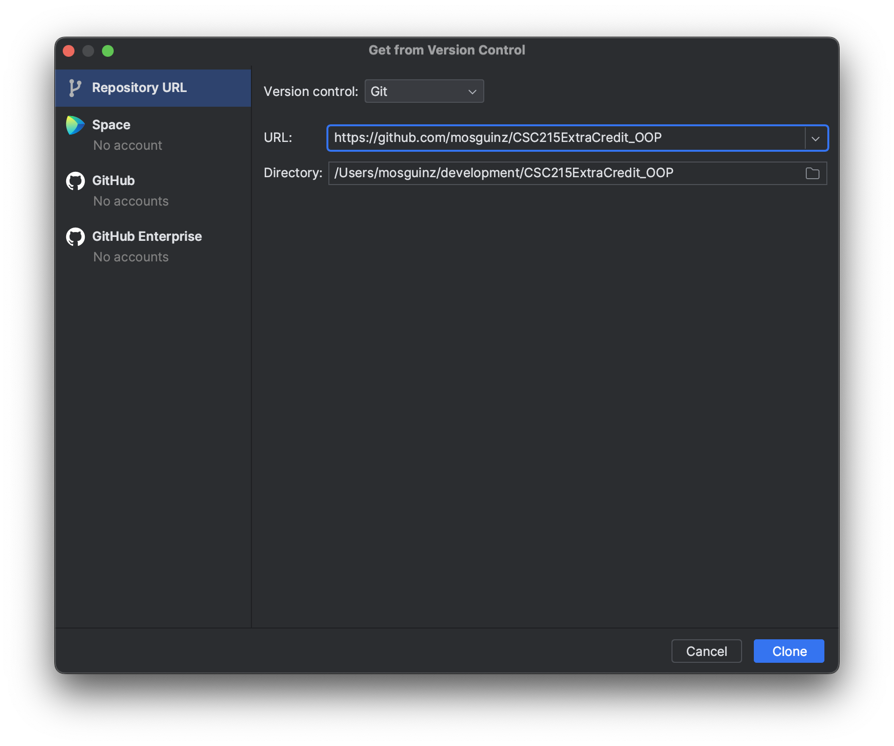
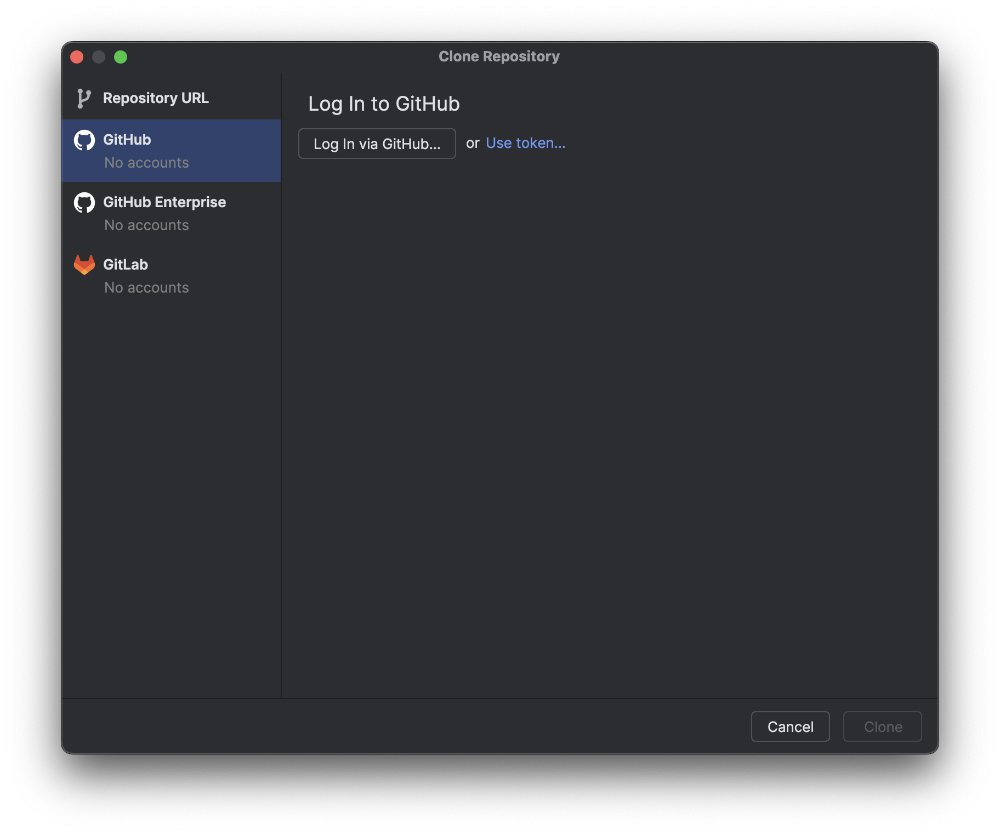
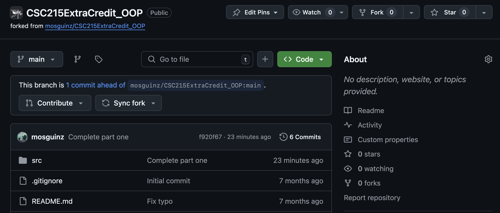

# CSC 215 — DS Extra Credit 1

Inside the source folder is the `Student` class that we designed together in our discussion session, along with
the `Course` and `Name` classes.

`CSStudent` is a child of `Student`, containing one additional field, `favoriteLanguage`.

**Estimated burden:** 5–15 minutes

## Instructions

The provided main method has an instance of `CSStudent` and `Student` created for you.

Only update **two methods** outlined below. Nothing else.

### First, update `getUnits()` in `Student` (2 points)

Update this method to calculate the number of units based on the classes they're taking.

> 1 point for attempt. 2 points for correct implementation.

### Second, update `printStudent()` in `Main` (3 points)

The method already prints out the student's name and the courses they're taking. Update this method so that it prints
the student's favorite language if they are a `CSStudent`.

> 1 point for attempt. 3 points for correct implementation.

When complete, you should see the following as the output:

```
Name: Alice Wonderland
Favorite language: Java
CSC 215    Units:  4
MATH 225   Units:  3
ANTH 100   Units:  3
Total units:      10
----------------------
Name: Bob McKendrick
ROK 193    Units:  3
ART 221    Units:  3
Total units:       6
```

## Setting up

### Option 1: Download as ZIP folder

To download the code, click on "Code" button above and click "Download ZIP." Extract the folder and copy the contents of
the src folder to your IDE.

### Option 2: Using Git

Alternatively in IntelliJ, you can import this file by going to <kbd>File</kbd> > <kbd>New</kbd> > <kbd>Project from Version Control...</kbd>. Make
sure the version control is set to Git. In the URL field, paste in `https://github.com/mosguinz/CSC215ExtraCredit_OOP`.



### Option 3: Forking and submitting a pull request

> [!NOTE]
> This requires a GitHub account.

1. First, create a fork of this repository by using the `Fork` button above.
2. In IntelliJ, clone the fork by going to <kbd>File</kbd> > <kbd>New</kbd> > <kbd>Project from Version Control...</kbd>.
3. On the left-hand side, click on the GitHub tab and log in to your GitHub account.
   
4. Return to IntelliJ, and select the name of the forked repository.

## Submission

### Set up via Options 1 and 2

To submit, simply email me with the subject "CSC 215 Extra Credit 1" and attach the source folder.

### Set up via Option 3

> [!IMPORTANT]
> The following instructions assumes that you have already pushed your changes to the fork.

1. Go to the forked repository.
2. At the top of the page, click on `Contribute`, then `Open pull request`.
   
3. Place your name in the title of the pull request and submit.

For more information on how to create a pull request, click [here](https://docs.github.com/en/pull-requests/collaborating-with-pull-requests/proposing-changes-to-your-work-with-pull-requests/creating-a-pull-request-from-a-fork).

🎉 Congratulations on completing your first pull request!

